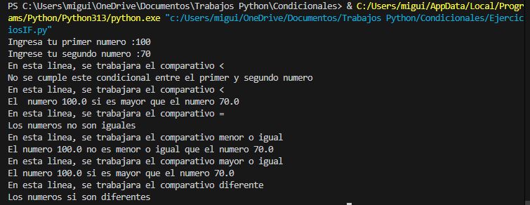

# Condicionales
## Miguel Galindo

### Aqui vamos a probar cada distinta combinacion
### Para comprobar las primeras lineas, ingresaremos el primer numero mayor que el segundo

### En la imagen se evidencia que el if y el else del codigo esta funcional