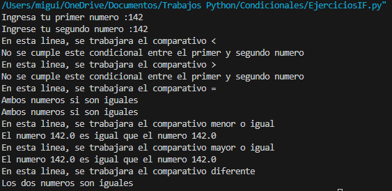

# Condicionales
## Miguel Galindo

### Aqui vamos a probar cada distinta combinacion
### Para comprobar las primeras lineas, ingresaremos el primer numero mayor que el segundo

### La siguiente condicion, es si el primer numero es menor que el segundo

### Otra condicion que se va a poner a prueba es la de igual "="

### Con todos estos casos se pueden comprobar en su totalidad el codigo, por ultimo, resaltare que decidi convertir los numeros ingresados en tipo float para que no haya problema si el numero es entero o no.