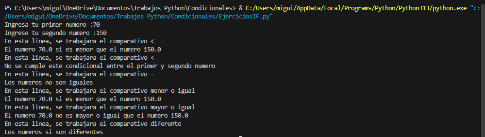

# Condicionales
## Miguel Galindo

### Aqui vamos a probar cada distinta combinacion
### Para comprobar las primeras lineas, ingresaremos el primer numero mayor que el segundo

### La siguiente condicion, es si el primero numero es menor que el segundo
